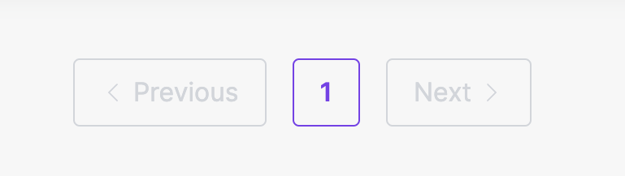

## Course

This repo contains all the code produced during the course **"Desenvolvendo Blog Internacional com Sanity e Next
"** on **Udemy**, unfortunately this course is no more available to buy.

## 🛠 Skills

![nextjs][nextjs] ![tailwindcss][tailwindcss] ![typescript][typescript] ![sanity][sanity]

## Changelog

On this section you can find some of the changes I have made during this course

- [x] **Custom layout**:
  - On this repo you will not find the same layout as the course, I have been searching for inspiration on **Figma**, **Pinterest**, **Dribble**, etc.
- [x] Use **Tailwind CSS** instead of **Sass**;

### Layout changes

Custom Code Block

<ul>
<li>using <code>react-syntax-highlighter</code>;</li>
<li>add copy button;</li>
<li>add filename with extension on top;</li>
</ul>

<blockquote>Used <strong>Dracula</strong> theme colors.</blockquote>

Custom Quote

<ul>
<li>Create custom quote block, with quote and author or source;</li>
</ul>

Custom Author Footer

<ul>
<li>button to copy blog post link;</li>
<li>show all author details <small>(social links, bio and photo)</small>;</li>
</ul>

Pagination

<ul>
<li>Disable <strong>Next.js Link</strong> when doen't have next/previous page;</li>
</ul>

## 🔗 More About Me

[nextjs]: https://img.shields.io/badge/nextjs-1C1C1F?style=for-the-badge&logo=next.js&logoColor=white
[tailwindcss]: https://img.shields.io/badge/tailwindcss-1C1C1F?style=for-the-badge&logo=tailwindcss&logoColor=white
[typescript]: https://img.shields.io/badge/typescript-1C1C1F?style=for-the-badge&logo=typescript&logoColor=white
[sanity]: https://img.shields.io/badge/sanity-1C1C1F?style=for-the-badge
